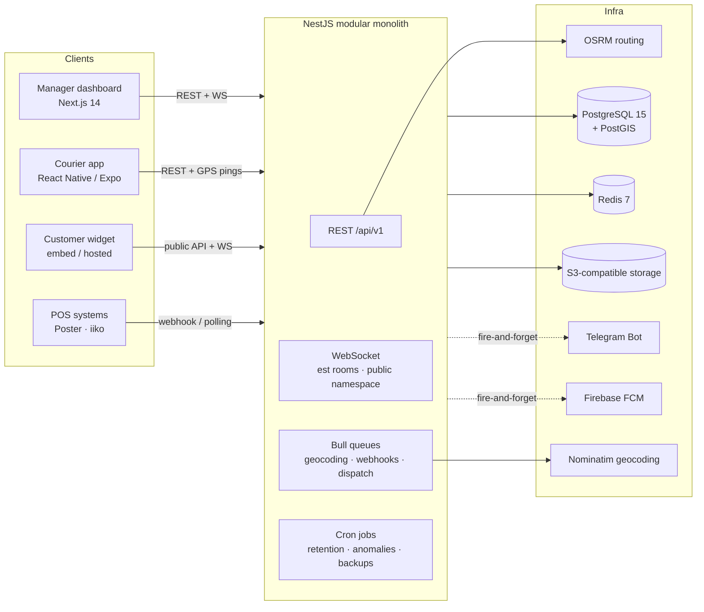

# OwnFleet

[](https://github.com/Volodymyr4K/ownfleet/actions/workflows/ci.yml)
[](LICENSE)

**English** | [Українська](README.uk.md)

Open-source courier management platform for restaurants, cafés and pizzerias that run their **own** delivery fleet. One system instead of phone calls and spreadsheets: live GPS tracking, smart dispatch, delivery ETA, geo-verified proof of delivery, POS integrations and a customer-facing tracking widget.

> Three apps, one monorepo: **REST + WebSocket API** (NestJS), **manager dashboard** (Next.js), **courier app** (React Native / Expo).

---

## Engineering highlights

- **Multi-tenant by construction** — every table carries `establishment_id`, tenant isolation enforced on every request via JWT payload + guards; covered by dedicated isolation tests.
- **Real-time GPS pipeline** — courier app pings every 15 s → Redis → WebSocket rooms (`est:{id}`) → live dashboard map. Separate public WS namespace for customer tracking.
- **Dispatch engine** — three modes (`manual` / `recommend` / `auto`): PostGIS distance zoning, workload scoring, OSRM ETA deduplicated per transport mode (≤ 4 routing calls regardless of courier count), race-protected assignment.
- **Geo-verified proof of delivery** — mandatory GPS proof with 300 m radius check (`geo_match`), optional photo to S3-compatible storage via presigned URLs; proof records are never deleted by retention.
- **Explicit state machines** — orders, deliveries and shifts move only through guarded transitions; invalid transitions are tested as thoroughly as valid ones.
- **Async everywhere it matters** — Bull queues for geocoding (Nominatim rate limit 1 req/s), webhook retries with HMAC signatures, dispatch timeouts; Telegram/FCM notifications are strictly fire-and-forget.
- **Operations built in** — Prometheus metrics (`/metrics` + Grafana Cloud via Alloy sidecar), 9 retention/anomaly cron jobs, weekly S3 backups, structured logging.
- **555 tests** across API (Jest) and web (Vitest), green in CI.

## Features

| Area | What it does |
|------|--------------|
| Live map | Full-screen Leaflet map, courier markers with status (online / background / not responding), real OSRM road routes for the selected courier |
| Dispatch | Manual assignment, one-click recommendation, or fully automatic dispatch with escalation alerts |
| ETA | Per-transport-mode ETA (car, moped, bicycle, walking) via OSRM; overdue-delivery alerts |
| Shifts | Courier-initiated shifts, auto-close after inactivity, "didn't show up" reminders via Telegram |
| Proof of delivery | GPS verification + photo, anomaly flags, manager-side proof viewer |
| Customer tracking | Embeddable widget + hosted tracking page, token-based access (122-bit entropy, 4 h TTL), light theme for restaurant websites |
| POS integrations | Poster (webhook + HMAC validation), iiko (polling with backoff); idempotent order ingestion |
| Notifications | Telegram bot for managers and couriers, FCM push for the courier app |
| Analytics | Delivery stats, courier efficiency, history with date filters |

## Architecture

Modular monolith — one NestJS application, strict module boundaries (no direct cross-module imports), PostgreSQL + PostGIS, Redis for cache/queues/pub-sub.



Key decisions are documented in [02_Architecture_v1.2.md](02_Architecture_v1.2.md) (1800+ lines) and the product rationale in [01_Product_Vision.md](01_Product_Vision.md).

## Tech stack

| Layer | Technology |
|-------|------------|
| Backend | NestJS (TypeScript, strict mode), Prisma ORM |
| Database | PostgreSQL 15 + PostGIS |
| Cache / queues / pub-sub | Redis 7 + Bull |
| Manager dashboard | Next.js 14 App Router, shadcn/ui, Tailwind |
| Courier app | React Native + Expo SDK 51 |
| Maps & routing | Leaflet + OpenStreetMap, OSRM |
| Geocoding | Nominatim + Redis cache (30-day TTL) + rate-limited queue |
| Files | S3-compatible storage (Cloudflare R2), presigned URLs |
| Notifications | Telegram Bot API, Firebase FCM |
| Auth | JWT access (15 min) + refresh tokens (30 days, HttpOnly cookie) |
| Observability | Prometheus + Grafana Cloud (Alloy sidecar) |

## Repository layout

```
apps/
  api/      NestJS backend (25 modules, Prisma schema, Jest tests)
  web/      Next.js manager dashboard + embeddable tracking widget
  mobile/   React Native courier app (Expo)
infra/
  docker/         local PostgreSQL + Redis
  grafana-alloy/  metrics sidecar for Grafana Cloud
```

## Quickstart

Prerequisites: Node.js ≥ 20, Docker.

```bash
# 1. Infrastructure (PostgreSQL + PostGIS on :5435, Redis on :6380)
docker compose -f infra/docker/docker-compose.yml up -d

# 2. API
cd apps/api
cp .env.example .env          # defaults match the docker-compose above
npm install
npx prisma migrate deploy
npm run seed:test-tenant      # demo establishment, users, couriers, orders
npm run start:dev             # http://localhost:3000

# 3. Dashboard
cd ../web
npm install
npm run dev                   # http://localhost:3001

# 4. Courier app (optional)
cd ../mobile
npm install
npm start                     # Expo dev server
```

Demo logins after seeding (see `apps/api/scripts/seed-test-tenant.cjs`):

| Role | Email | Password |
|------|-------|----------|
| Owner | `owner-test-kitchen-kyiv@ownfleet.app` | `Owner123!Test` |
| Manager | `manager-test-kitchen-kyiv@ownfleet.app` | `Manager123!Test` |

## Tests

```bash
cd apps/api && npm test      # 533 tests — state machines, tenant isolation, geo-proof, dispatch, HMAC
cd apps/web && npm test      # 22 tests — tracking widget + token redirect
```

Priority-zero suites (merge blockers): all state-machine transitions, cross-tenant data isolation, 300 m geo-proof check, retention safety of delivery proofs, WebSocket auth rejection, POS backoff behavior.

## Documentation

| Doc | Contents |
|-----|----------|
| [01_Product_Vision.md](01_Product_Vision.md) | Problem, market, product decisions |
| [02_Architecture_v1.2.md](02_Architecture_v1.2.md) | Full system architecture |
| [03_Feature_DeliveryETA.md](03_Feature_DeliveryETA.md) | ETA engine design |
| [04_Feature_LiveTrackingAPI.md](04_Feature_LiveTrackingAPI.md) | Tracking API design |
| [05_Feature_AutoDispatch_Automatic.md](05_Feature_AutoDispatch_Automatic.md) | Dispatch algorithm |
| [07_Feature_CustomerTracking.md](07_Feature_CustomerTracking.md) | Customer tracking widget |
| [DESIGN/DESIGN.md](DESIGN/DESIGN.md) | Design system (dark-first, Manrope, semantic-only colors) |
| [DEPLOY.md](DEPLOY.md) | Deployment decisions & checklist |

> Product and architecture docs are written in Ukrainian — the product targets the Ukrainian food-delivery market.

## License

[MIT](LICENSE)
