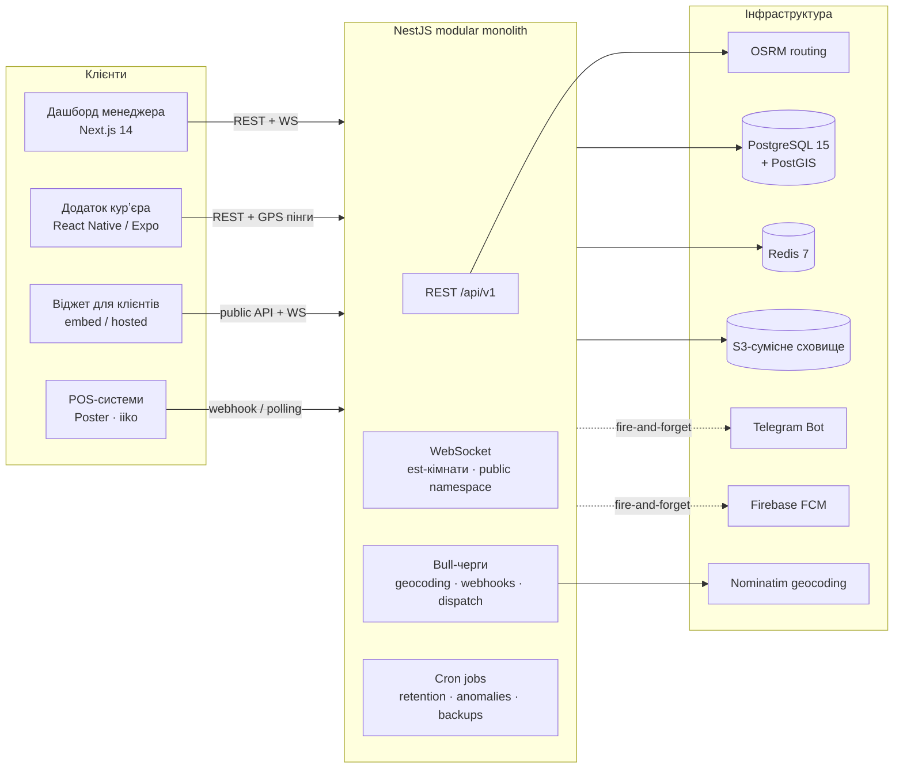

# OwnFleet

[](https://github.com/Volodymyr4K/ownfleet/actions/workflows/ci.yml)
[](LICENSE)

[English](README.md) | **Українська**

Open-source платформа управління курʼєрами для ресторанів, кафе і піцерій, які працюють із **власним** флотом доставки. Одна система замість дзвінків і таблиць: live GPS-трекінг, розумний диспатч, ETA доставки, гео-верифікований пруф доставки, інтеграції з POS і трекінг-віджет для клієнтів.

> Три застосунки в одному монорепо: **REST + WebSocket API** (NestJS), **дашборд менеджера** (Next.js), **додаток курʼєра** (React Native / Expo).

---

## Інженерні рішення

- **Multi-tenancy за побудовою** — кожна таблиця має `establishment_id`, ізоляція тенанта перевіряється на кожному запиті через JWT payload + guards; покрито окремими тестами ізоляції.
- **Real-time GPS pipeline** — додаток курʼєра пінгує кожні 15 с → Redis → WebSocket-кімнати (`est:{id}`) → жива мапа на дашборді. Окремий публічний WS namespace для клієнтського трекінгу.
- **Dispatch engine** — три режими (`manual` / `recommend` / `auto`): зонування відстані через PostGIS, скоринг завантаженості, OSRM ETA з дедуплікацією за transport mode (≤ 4 routing-виклики незалежно від кількості курʼєрів), захист від race conditions при призначенні.
- **Гео-верифікований пруф доставки** — обовʼязковий GPS-пруф із перевіркою радіуса 300 м (`geo_match`), опціональне фото в S3-сумісне сховище через presigned URLs; записи пруфів ніколи не видаляються retention-ом.
- **Явні state machines** — замовлення, доставки і зміни переходять тільки через guarded-переходи; невалідні переходи тестуються так само ретельно, як валідні.
- **Асинхронність там, де треба** — Bull-черги для геокодування (rate limit Nominatim 1 req/s), retry вебхуків із HMAC-підписами, dispatch-таймаути; Telegram/FCM — строго fire-and-forget.
- **Операційка вбудована** — Prometheus метрики (`/metrics` + Grafana Cloud через Alloy sidecar), 9 retention/anomaly cron jobs, щотижневі S3-бекапи, структуроване логування.
- **555 тестів** — API (Jest) і web (Vitest), зелені в CI.

## Можливості

| Область | Що робить |
|---------|-----------|
| Жива мапа | Повноекранна Leaflet-мапа, маркери курʼєрів зі статусом (онлайн / фон / не відповідає), реальні OSRM-маршрути для вибраного курʼєра |
| Диспатч | Ручне призначення, рекомендація в один клік або повністю автоматичний диспатч з ескалаційними алертами |
| ETA | ETA по transport mode (авто, мопед, велосипед, пішки) через OSRM; алерти про прострочені доставки |
| Зміни | Курʼєр сам стартує зміну, авто-закриття після неактивності, нагадування «не вийшов» через Telegram |
| Пруф доставки | GPS-верифікація + фото, anomaly flags, перегляд пруфу менеджером |
| Клієнтський трекінг | Embeddable віджет + hosted-сторінка, доступ за токеном (122 біти ентропії, TTL 4 год), світла тема для сайтів ресторанів |
| POS-інтеграції | Poster (webhook + HMAC-валідація), iiko (polling з backoff); ідемпотентний прийом замовлень |
| Нотифікації | Telegram-бот для менеджерів і курʼєрів, FCM push для додатку курʼєра |
| Аналітика | Статистика доставок, ефективність курʼєрів, історія з фільтрами за датами |

## Архітектура

Modular monolith — один NestJS застосунок, чіткі межі модулів (без прямих cross-module імпортів), PostgreSQL + PostGIS, Redis для кешу/черг/pub-sub.



Ключові рішення задокументовані в [02_Architecture_v1.2.md](02_Architecture_v1.2.md) (1800+ рядків), продуктова логіка — в [01_Product_Vision.md](01_Product_Vision.md).

## Tech stack

| Шар | Технологія |
|-----|------------|
| Backend | NestJS (TypeScript, strict mode), Prisma ORM |
| База даних | PostgreSQL 15 + PostGIS |
| Кеш / черги / pub-sub | Redis 7 + Bull |
| Дашборд менеджера | Next.js 14 App Router, shadcn/ui, Tailwind |
| Додаток курʼєра | React Native + Expo SDK 51 |
| Мапи й маршрути | Leaflet + OpenStreetMap, OSRM |
| Геокодування | Nominatim + Redis-кеш (TTL 30 днів) + rate-limited черга |
| Файли | S3-сумісне сховище (Cloudflare R2), presigned URLs |
| Нотифікації | Telegram Bot API, Firebase FCM |
| Auth | JWT access (15 хв) + refresh-токени (30 днів, HttpOnly cookie) |
| Observability | Prometheus + Grafana Cloud (Alloy sidecar) |

## Структура репозиторію

```
apps/
  api/      NestJS backend (25 модулів, Prisma schema, Jest-тести)
  web/      Next.js дашборд менеджера + embeddable трекінг-віджет
  mobile/   React Native додаток курʼєра (Expo)
infra/
  docker/         локальні PostgreSQL + Redis
  grafana-alloy/  metrics sidecar для Grafana Cloud
```

## Швидкий старт

Потрібно: Node.js ≥ 20, Docker.

```bash
# 1. Інфраструктура (PostgreSQL + PostGIS на :5435, Redis на :6380)
docker compose -f infra/docker/docker-compose.yml up -d

# 2. API
cd apps/api
cp .env.example .env          # дефолти збігаються з docker-compose вище
npm install
npx prisma migrate deploy
npm run seed:test-tenant      # демо-заклад, користувачі, курʼєри, замовлення
npm run start:dev             # http://localhost:3000

# 3. Дашборд
cd ../web
npm install
npm run dev                   # http://localhost:3001

# 4. Додаток курʼєра (опційно)
cd ../mobile
npm install
npm start                     # Expo dev server
```

Демо-логіни після сіду (див. `apps/api/scripts/seed-test-tenant.cjs`):

| Роль | Email | Пароль |
|------|-------|--------|
| Owner | `owner-test-kitchen-kyiv@ownfleet.app` | `Owner123!Test` |
| Manager | `manager-test-kitchen-kyiv@ownfleet.app` | `Manager123!Test` |

## Тести

```bash
cd apps/api && npm test      # 533 тести — state machines, ізоляція тенантів, geo-proof, dispatch, HMAC
cd apps/web && npm test      # 22 тести — трекінг-віджет + token redirect
```

P0-сьюти (блокують мерж): усі переходи state machines, крос-тенантна ізоляція даних, перевірка geo-proof 300 м, retention-захист пруфів доставки, відхилення невалідного WebSocket auth, backoff для POS.

## Документація

| Документ | Зміст |
|----------|-------|
| [01_Product_Vision.md](01_Product_Vision.md) | Проблема, ринок, продуктові рішення |
| [02_Architecture_v1.2.md](02_Architecture_v1.2.md) | Повна архітектура системи |
| [03_Feature_DeliveryETA.md](03_Feature_DeliveryETA.md) | Дизайн ETA-движка |
| [04_Feature_LiveTrackingAPI.md](04_Feature_LiveTrackingAPI.md) | Дизайн Tracking API |
| [05_Feature_AutoDispatch_Automatic.md](05_Feature_AutoDispatch_Automatic.md) | Алгоритм диспатчу |
| [07_Feature_CustomerTracking.md](07_Feature_CustomerTracking.md) | Клієнтський трекінг-віджет |
| [DESIGN/DESIGN.md](DESIGN/DESIGN.md) | Дизайн-система (dark-first, Manrope, semantic-only кольори) |
| [DEPLOY.md](DEPLOY.md) | Деплойні рішення та чекліст |

## Ліцензія

[MIT](LICENSE)
